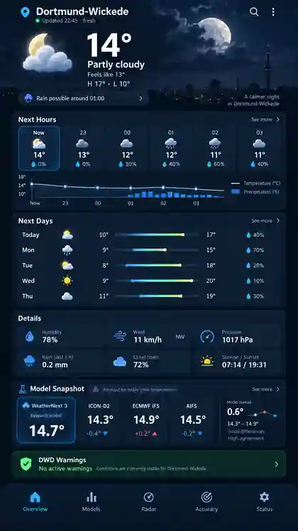

# UI / UX

> **Current status note (2026-09-28):** [audits un ieviešanas plāns](audits/2026-09-26/README.md) sasaista 28 uzlabojumus ar sešiem ieviešanas posmiem. Zemāk saglabātā #170 reference un sākotnējā specifikācija ir historical design evidence, nevis current runtime/data contract. Tās `station_10416`, `Combined`, kvantiļu un probability piemēri nedrīkst tikt interpretēti kā pašreiz ieviestas funkcijas vai reāli provider dati. Current canonical benchmark ir `station_05480`; `station_10416` ir legacy/MOSMIX compatibility only. Overview izskata aktuālais lēmums ir “Approved Overview A — 2026-09-27”.

## Current implementation status — 2026-09-28

### Implemented / source-proven

- Public benchmark: `station_05480` / DWD CDC 05480; `station_10416` paliek legacy/MOSMIX reference compatibility.
- Primary navigation: `Overview`, `Models`, `Radar`, `Accuracy`, `Status`; direct-link/hash navigation, Back/Forward, section focus and skip-link behavior are covered by browser regression proof (PR #251).
- Accepted compact blue Overview A with Auto/Light/Dark themes, mobile-first layout, daily min/max + precipitation amount presentation and missing-data handling.
- DWD warning lifecycle/state handling, startup/return/reconnect refresh, last-known/stale preservation and human-readable authoritative warning content are implemented in PR #241–#243. DWD remains the official warning authority.
- Model Snapshot spread compares provider values only at one exact shared `valid_time_utc`; providers without that time are excluded rather than compared against another forecast hour (PR #244).
- `[hidden]` rendering behavior and real-shell accessible control names/focus-visible contract have browser regression coverage (PR #257 and #258).
- Responsive navigation acceptance covers 320/390/412/720/1440 CSS-pixel widths; 720 CSS px is the 1440-at-200%-zoom layout equivalent used by the browser proof (PR #251).

### Planned / incomplete

- Product-wide i18n/LV↔EN behavior and the default-language decision are not yet complete. Do not infer a language switch contract from historical examples.
- V3 responsive/a11y visual acceptance for the accepted Models/Radar/Accuracy/Status designs remains incomplete under #237.
- T3–T6 technical work remains for location/observation/forecast provenance interactions, radar player/data handling, deeper Models/Accuracy behavior, loading/race/PWA/performance acceptance and remaining DST/missing-horizon cases.
- Full physical-device/production visual acceptance remains separate from source/browser regression proof and requires the applicable runtime/LIVE authority.

### Blocked / explicitly unavailable

- Real WeatherNext 3 private data remains pending the separate `#224 -> #122` prerequisite/access sequence. UI must keep explicit pending/unavailable state and must never fabricate WeatherNext values.
- `Combined` forecast/weighting is not an implemented production feature. Weighted Combined remains deferred until there is enough defensible verification corpus, transparent versioned weights and backtesting.
- Probabilities, Brier/CRPS or WeatherNext quantile displays are valid only when backed by genuine provider quantities/statistics. Deterministic precipitation amount (`mm`) must never be presented as probability (`%`).

## Mērķis

Mobile-first privāts weather dashboard, kas informācijas ziņā ir tikpat ātri nolasāms kā tradicionāla weather app, bet papildus ļauj redzēt **modeļu atšķirības un WeatherNext 3 uncertainty/accuracy**.

Nav mērķa kopēt Meteo & Radar vizuālo dizainu. No tā izmantojam tikai ideju par:

- skaidru current section;
- hourly forecast;
- daily cards;
- ātri nolasāmiem precipitation/temperature indikatoriem.

## Historical consumer Overview visual reference — #170

Issue #170 consumer-weather implementation follows this approved mobile-first visual direction:



Canonical asset: `docs/ui/consumer-weather-overview-reference-v1.webp`.

The reference fixes the intended **information hierarchy and visual direction**, not literal weather values. All temperatures, precipitation, conditions and model values visible in the mockup are illustrative UI placeholders only and must never be treated as real provider/WeatherNext data.

The implemented Overview should preserve these structural decisions:

- weather-first hero with large temperature, condition, feels-like and daily high/low;
- scannable next-hours forecast with temperature and precipitation;
- compact next-days forecast with min/max temperature range and precipitation;
- current-condition detail tiles;
- first-page `Model Snapshot` showing WeatherNext 3, ICON-D2, ECMWF IFS and AIFS side by side so disagreement is visible without opening `Models`;
- detailed provider/model analysis remains in `Models`;
- DWD warning state remains visually distinct and authoritative;
- `Overview`, `Models`, `Radar`, `Accuracy`, `Status` remain primary navigation destinations.

Provider-level values must remain attributable and must not be hidden behind a fabricated Combined value. WeatherNext 3 values are shown only when genuine data is available; otherwise the UI keeps an explicit pending/unavailable state.

## Primary navigation

Minimum tabs/sections:

- `Overview`
- `Models`
- `Radar`
- `Accuracy`
- `Sources/Status`

## Overview

The following block is historical #170 concept text, not current runtime evidence:

```text
Home — Dortmund-Wickede
Updated 22:15 · Europe/Berlin

CURRENT
19.2 °C   Mostly cloudy
DWD observation · station 10416

NEXT HOURS
22  23  00  01  02  03
19  18  18  17  17  16 °C
      precipitation bars

MODEL CONSENSUS
DWD ICON-D2      ━━━━━━━━━
WeatherNext 3    ┅┅┅┅┅┅┅┅
ECMWF IFS        ┄┄┄┄┄┄┄┄

WEATHERNEXT 3 UNCERTAINTY
mean: 18.4 °C
p10 ├───────●────────┤ p90

TODAY / NEXT DAYS
[day cards]

DWD WARNINGS
No active warnings
```

## WeatherNext prominence

WeatherNext 3 jābūt redzamam bez nepieciešamības iet dziļā settings ekrānā.

Historical target when genuine WeatherNext data exists:

- WeatherNext chosen forecast value;
- init time / freshness;
- p10–p90 uncertainty band only when genuine quantiles exist;
- indikators, cik tālu WeatherNext atšķiras no other providers at a defensible common valid time.

Models view jābūt WeatherNext-first detalizētam salīdzinājumam. Kamēr real private access nav gatavs, UI saglabā explicit pending/unavailable state.

## Models view

Historical/planned filters:

- variable: temperature / precipitation / wind;
- horizon: 24 h / 48 h / 5 d / 10 d / 15 d;
- providers toggle.

Historical/planned chart behavior:

- atsevišķa līnija katram provider;
- WeatherNext p10–p90 shaded band tikai ar genuine quantile data;
- provider init time tooltip;
- dashed/stale presentation, ja dati veci;
- observation overlay vēsturiskajā daļā.

## Accuracy view

Galvenā sadaļa projekta pētniecības mērķim.

Historical/planned cards include:

- Temperature MAE last 30d;
- precipitation probabilistic score only where genuine probability observations/forecasts support it;
- provider comparison by lead bucket;
- WeatherNext trend vs previous 30d only after enough genuine samples exist;
- current WeatherNext model version when real provider data exists.

Charts can include:

- MAE by lead-time bucket;
- bias by provider;
- WeatherNext p10–p90 coverage only with genuine quantile pairs;
- precipitation reliability only with genuine probability data;
- monthly comparison after enough common samples exist.

Jārāda sample size `n`, period, common-sample/readiness state un relevant provenance. UI nedrīkst fabricēt “best provider” vai probabilistic metrics no nepietiekamiem datiem.

## Radar view

Planned technical target under #237:

- DWD radar map for the selected privacy-safe reference/location contract;
- time slider/player;
- observed precipitation layer;
- optional forecast/nowcast extension tikai ar skaidru label;
- private-home centering only after separate explicit private-home/runtime authorization.

## Warning UX

DWD warnings vienmēr augstākas prioritātes nekā model disagreement cards.

Warning card rāda tikai laukus, ko piegādā normalizētais backend contract, piemēram:

- official DWD label;
- severity;
- valid period;
- headline/event;
- available area/reference semantics;
- last-check/retrieval context without inventing a DWD publication timestamp.

WeatherNext vai jebkurš model output nedrīkst radīt vizuāli identisku “official warning” card. Neizdomāt affected-area/source-link laukus, ja backend tos nepiegādā.

## Daily cards

Current Overview daily data uses one selected provider's existing API aggregates. Historical provider-switch concepts such as:

```text
Combined | DWD | WeatherNext | ECMWF
```

nav current implemented contract; īpaši `Combined` nav gatavs.

Katram day card drīkst rādīt tikai pieejamus source-backed laukus, piemēram:

- max/min temperature;
- precipitation amount (`mm`);
- source/provenance;
- additional condition/wind/sun fields only when the API/provider contract actually supplies them.

Probability un amount jāpaliek atsevišķām quantities; missing values paliek `—`.

## Model disagreement

Lietotājam jāredz, ja modeļi nepiekrīt, bet tikai uz salīdzināma location/quantity/exact valid time pamata. Current Model Snapshot spread ir descriptive provider disagreement, nevis calibrated uncertainty/probability.

Historical concept examples such as `Forecast spread: HIGH` vai `Rain probability: 20–75%` nav current contract un netiek rādīti bez definētas metodikas/genuine probability data.

Nedrīkst slēpt disagreement aiz viena “combined” skaitļa.

## Freshness

Katram provider, kur dati pieejami, provenance jāļauj sasniegt vismaz init/retrieval/valid/statistic/model-version dimensijas, cik tās piegādā contract. Ja provider stale/unavailable/pending, UI to skaidri parāda.

## PWA

MVP/current direction:

- installable home-screen app;
- responsive Android/desktop;
- cached app shell;
- forecast dati var prasīt network;
- push notifications paliek atsevišķs nākotnes scope un nav pašreiz autorizētas/ieviestas ar šo dokumentu.

Service-worker cache version ir implementation detail; current `static/sw.js` ir authority, nevis vēsturisks versijas numurs šajā dokumentā.

## Accessibility / clarity

- nebalstīt nozīmi tikai uz krāsu;
- °C/mm/kmh/hPa skaidri norādīti;
- tooltip/legend modeļu līnijām;
- local time vienmēr `Europe/Berlin`;
- “AI forecast” un “official warning” semantiski nošķirti;
- interactive controls require accessible names and visible keyboard focus;
- direct-link navigation, Back/Forward and section focus semantics remain regression-tested.

## Approved Overview A — 2026-09-27

The owner approved the compact blue A variant for implementation, prioritizing Galaxy A55 and S25+ mobile layouts. This supersedes the #170 reference **for Overview appearance**; its source attribution and weather-first intent remain applicable. The #170 image above is historical evidence, not the current color/layout specification.

Implementation: `static/accepted_ui.css`, `static/ui_preferences.js`, `static/daily_trend.js` plus the existing API renderers. No backend, database or provider changes are required.

- Blue light/dark tokens, compact 14px cards, 70px mobile hero temperature, 54px hourly columns and 44px or larger primary controls. Model cards use two columns on mobile, four on desktop.
- Appearance selector: Auto / Light / Dark, persisted when browser storage is available. Auto uses **20:00–07:00 Europe/Berlin**, reevaluated each minute and on return to the tab. This is a fixed local-time schedule, not astronomical sunset. Provider daylight continues to govern weather icons independently.
- Daily min/max plot uses only one existing chosen provider's API aggregates, up to 14 returned days. Default is seven; 14-day control is disabled for shorter horizons. The actual available count is visible. Unknown values show `—`; temperature lines break on missing values and date gaps. Precipitation is mm, never probability.
- Day buttons expose the values to keyboard/screen-reader users; the expandable table includes init time/quality and retrieval timestamps. The daily provider/freshness surface remains visible. Hero high/low is today's forecast only, with no substitution from a later date.
- DWD warning summary is placed above the observation card. At the time of #240 its neutral unknown state intentionally made no all-clear claim; automatic loading, lifecycle handling and readable DWD warning content were subsequently implemented in PR #241–#243.
- At #240 the service-worker shell cache advanced to v11. Current cache version is intentionally not pinned here; `static/sw.js` is the source of truth.

Validation at #240 included dependency-free Node behavior tests for theme boundaries including DST, provider separation, missing data, line gaps, source escaping and short horizons. Subsequent browser regression work under #237 added real-shell responsive/navigation proof (#251), rendered `[hidden]` proof (#257) and accessible-control-name/focus-visible proof (#258). These source/browser proofs are still distinct from physical-device or production/RPi visual acceptance.

Follow-up stays with #237: product-wide i18n/default-language decision, V3 other-view responsive/a11y visual acceptance, T3–T6 technical work, provenance expansion and complete accessibility/performance acceptance. Warning lifecycle and exact model valid-time alignment are source-complete. This Overview delivery does not close that epic or authorize deployment.
